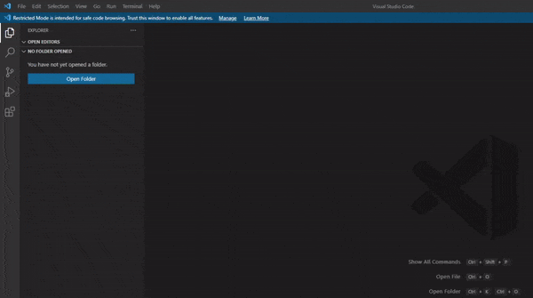

# Introduction to Visual Studio Code and C++

In this lab, we will be configuring and introducing the basics of Visual Studio Code, a highly customizable development environment with many useful features from syntax highlighting to intelligent code completion. Due to its convenience and customizability, it is the most popular development environment in the world. Today, you will learn how to configure VSCode to work with C++, play around with some basic programs, and learn about some of the many useful features that VSCode has.

## Part 1: Installation and Configuration

First, install the correct version of VSCode at [this link](https://code.visualstudio.com/download) for your operating system and processor. Once VSCode is installed, open it and install the C++ extension by going to the extension tabs on the taskbar on the left, searching for the C++ extension by Microsoft, and install it.

Now, in order to configure VSCode to work with C++, we must install a C++ compiler. The way we install our compiler varies on which operating system we are using, so drop down the appropriate list and follow the instructions there.

[comment]: # (Maybe add a way to check processor type if the student is unsure which version to install?)

Windows 11/Windows 10

On Windows, we will be installing MinGW so that we can compile our C++ programs using the <code>g++</code> command.  
1. Download the MinGW Installation Manager Setup Tool at <a href="https://sourceforge.net/projects/mingw/">this link</a>.  
2. Run the setup executable. <strong>Take note of your installation directory!</strong> By default, it should be <code>C:\MinGW</code>, but if it is something else or you want to change it somewhere else, remember where it is installed. This will be very important later.  
3. Open the MinGW Installation Manager after it is done setting up. You should see multiple packages, but we only need 4 of them:  
<code>
mingw-developer-toolkit 
mingw32-base 
mingw32-gcc-g++ 
msys-base
</code> 
Right-click each package, and click "Mark for installation". Then, in the top left corner, click Installation > Apply Changes.

